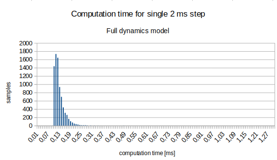
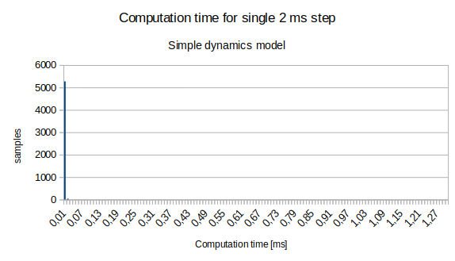

# Dynamic model of Velma

This package contains dynamic models of Velma robot. It uses [DART physics library](https://dartsim.github.io), version 6.7.2.
There are two models in this package: simple, full.
The full model is the same dynamic model as one used in Gazebo simulation within simulated control system, except collision checking is disabled.
The simple model is single-inertial model.

It requires packages with URDF models of the robot:
* [velma_description](https://github.com/RCPRG-ros-pkg/velma_robot.git)
* [lwr_defs](https://github.com/RCPRG-ros-pkg/lwr_robot.git)
* [barrett_hand_defs](https://github.com/RCPRG-ros-pkg/barrett_hand_robot.git)

## Installation

This package is intended to be built within a catkin workspace.
If you have workspace for Velma installed, as described in [https://github.com/RCPRG-ros-pkg/RCPRG_rosinstall](https://github.com/RCPRG-ros-pkg/RCPRG_rosinstall), just clone this repo into src and build.

For stand-alone workspace run the folowing commands:

```bash
mkdir -p ~/ws_velma_dyn/src
cd ~/ws_velma_dyn/src
git clone https://github.com/RCPRG-ros-pkg/velma_dynamic_model.git
git clone https://github.com/RCPRG-ros-pkg/velma_robot.git
git clone https://github.com/RCPRG-ros-pkg/lwr_robot.git
git clone https://github.com/RCPRG-ros-pkg/barrett_hand_robot.git
```
If you don't have DART 6.7.2 installed:
```bash
git clone -b v6.7.2 https://github.com/dartsim/dart.git
```

Then, configure and build workspace:
```bash
cd ~/ws_velma_dyn
source /opt/ros/melodic/setup.bash
catkin config --extend /opt/ros/melodic --cmake-args -DCMAKE_BUILD_TYPE=RelWithDebInfo -DCATKIN_ENABLE_TESTING=OFF
catkin build
```
## Running the test program

Here we assume, the workspace is in ~/ws_velma_dyn.
Open a new terminal and type commands:
```bash
source ~/ws_velma_dyn/devel/setup.bash
roscore
```
In the second terminal:
```bash
source ~/ws_velma_dyn/devel/setup.bash
roslaunch velma_dynamic_model velma_dynamic_model_test.launch model_type:=full
```
The last command should load URDF model of Velma robot into ROS param, run rviz and the test program with the full model.
To run the test for simple model, use argument model_type:=simple. 

## API

The model is implemented in C++ as wrapper for DART library.
The parameters of kinematics and dynamics are given as URDF file.
URDF file format specification is availabe in [https://wiki.ros.org/urdf/XML/robot](https://wiki.ros.org/urdf/XML/robot).
The class for simple model is declared in [include/velma_dynamic_model/velma_dynamic_model_simple.h](include/velma_dynamic_model/velma_dynamic_model_simple.h).
The class for full model is declared in [include/velma_dynamic_model/velma_dynamic_model_full.h](include/velma_dynamic_model/velma_dynamic_model_full.h).
It uses 2 ms simulation step, and internal collisions are not computed.
The example code that uses the library is in file [src/velma_dynamic_model_test.cpp](src/velma_dynamic_model_test.cpp).
The model can be loaded from ROS parameter server.
A complete example is given in file [src/velma_dynamic_model_test.cpp](src/velma_dynamic_model_test.cpp).

## Experiments

The measurements of computation time were made on Intel(R) Core(TM) i7-6820HQ CPU @ 2.70GHz.

### Full dynamics model
Distribution of computation time is given here:



### Simple dynamics model
Distribution of computation time is given here:



