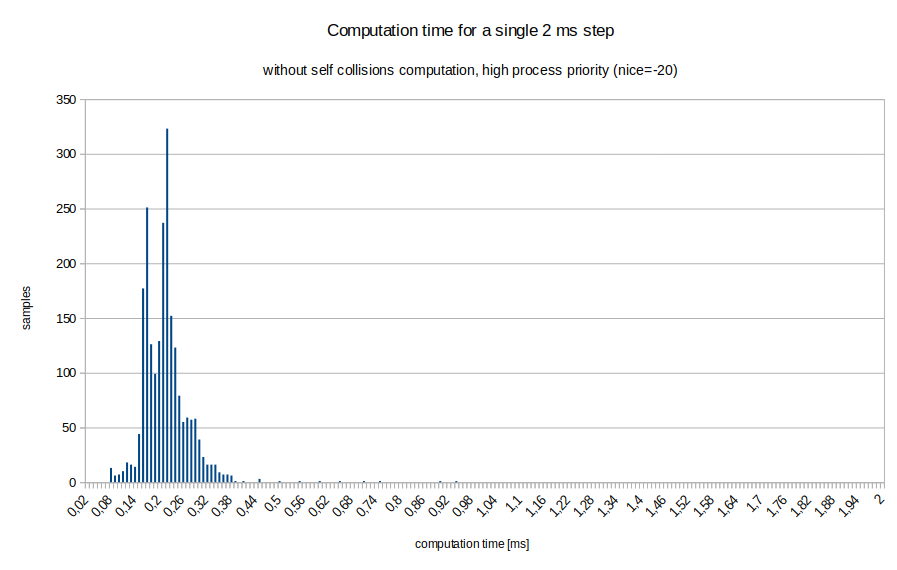

# Dynamic model of Velma

This package contains dynamic model of Velma robot. It uses [DART physics library](https://dartsim.github.io), version 6.7.2.
It is the same dynamic model as one used in Gazebo simulation within simulated control system, except collision checking is disabled.

It requires packages with URDF models of the robot:
* [velma_description](https://github.com/RCPRG-ros-pkg/velma_robot.git)
* [lwr_defs](https://github.com/RCPRG-ros-pkg/lwr_robot.git)
* [barrett_hand_defs](https://github.com/RCPRG-ros-pkg/barrett_hand_robot.git)

## Installation

This package is intended to be built within a catkin workspace.
If you have workspace for Velma installed, as described in [https://github.com/RCPRG-ros-pkg/RCPRG_rosinstall](https://github.com/RCPRG-ros-pkg/RCPRG_rosinstall), just clone this repo into src and build.

For stand-alone workspace run the folowing commands:

```bash
mkdir -p ~/ws_velma_dyn/src
cd ~/ws_velma_dyn/src
git clone https://github.com/RCPRG-ros-pkg/velma_dynamic_model.git
git clone https://github.com/RCPRG-ros-pkg/velma_robot.git
git clone https://github.com/RCPRG-ros-pkg/lwr_robot.git
git clone https://github.com/RCPRG-ros-pkg/barrett_hand_robot.git
```
If you don't have DART 6.7.2 installed:
```bash
git clone -b v6.7.2 https://github.com/dartsim/dart.git
```

Then, configure and build workspace:
```bash
cd ~/ws_velma_dyn
source /opt/ros/melodic/setup.bash
catkin config --extend /opt/ros/melodic --cmake-args -DCMAKE_BUILD_TYPE=RelWithDebInfo -DCATKIN_ENABLE_TESTING=OFF
catkin build
```
## Running the test program

Here we assume, the workspace is in ~/ws_velma_dyn.
Open a new terminal and type commands:
```bash
source ~/ws_velma_dyn/devel/setup.bash
roscore
```
In the second terminal:
```bash
source ~/ws_velma_dyn/devel/setup.bash
roslaunch velma_dynamic_model velma_dynamic_model_test.launch
```
The last command should load URDF model of Velma robot into ROS param, run rviz and the test program.

## API

The model is implemented in C++ as wrapper for DART library.
The parameters of kinematics and dynamics are given as URDF file.
URDF file format specification is availabe in [https://wiki.ros.org/urdf/XML/robot](https://wiki.ros.org/urdf/XML/robot).
The class for model is declared in [include/velma_dynamic_model/velma_dynamic_model.h](include/velma_dynamic_model/velma_dynamic_model.h).
It uses 2 ms simulation step, and internal collisions are not computed.
The example code that uses the library is in file [src/velma_dynamic_model_test.cpp](src/velma_dynamic_model_test.cpp).
The model can be loaded from ROS parameter server:
```cpp
VelmaDynamicModelPtr model = VelmaDynamicModel::createFromRosParam();
```
List of all link names:
```cpp
std::vector<std::string > link_names = model->getLinkNames();
```
You can access DART class for the robot model using method:
```cpp
model->getSkeleton()
```
This class is documented in DART API reference: [https://dartsim.github.io/api/v6.3.0/d3/d19/classdart_1_1dynamics_1_1Skeleton.html](https://dartsim.github.io/api/v6.3.0/d3/d19/classdart_1_1dynamics_1_1Skeleton.html)
To obtain forces for gravity compensation:
```cpp
Eigen::VectorXd grav_forces = model->getSkeleton()->getGravityForces();
```
Coriolis forces can be obtained using:
```cpp
Eigen::VectorXd coriolis_forces = model->getSkeleton()->getCoriolisForces();
```
There are also methods that get position and velocity:
```cpp
Eigen::VectorXd pos = model->getSkeleton()->getPositions();
Eigen::VectorXd vel = model->getSkeleton()->getVelocities();
```
To apply forces for the nex simulation step:
```cpp
model->getSkeleton()->setForces( grav_forces + coriolis_forces + cmd_ext_forces );
```
Forward kinematics for link with name link_name:
```cpp
Eigen::Isometry3d T_B_L;
model->getFk(link_name, T_B_L);
```
Finally, to simulate one simulation step:
```cpp
model->step();
```

## Experiments

Distribution of computation time is given here:



The measurements of computation time were made on Intel(R) Core(TM) i7-6820HQ CPU @ 2.70GHz.
